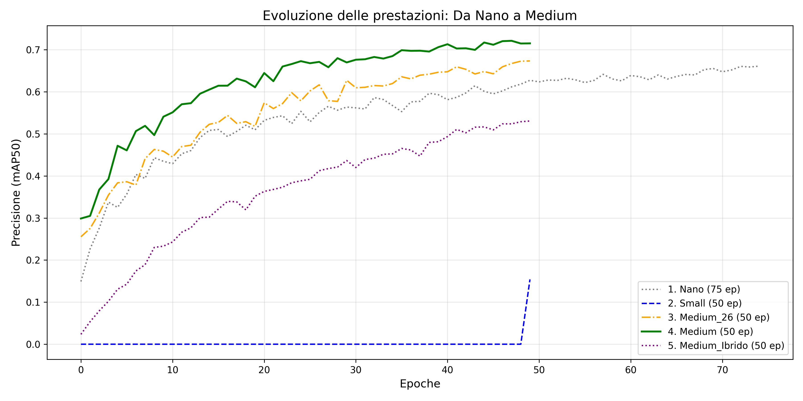

## Modelli object detection e mask segmentation su dataset pomodori 

Sviluppati 4 modelli tramite varie versioni di yolov11 (nano, small, medium) addestrati su diverse epoche.

Sono presenti tool di visualizzazione per testare i modelli:
-  [slideshow.py](slideshow.py) permette di visualizzare le varie immagini applicando le maschere di segmentazione su ogni oggetto e le etichette con il punteggio di confidenza.
- [slideshowNoText.py](slideshow_noText.py) vengono visualizzate esclusivamente le maschere colorate sugli oggetti.

Come possiamo vedere dal grafico qui sotto, il modello migliore è la versione medium addestrata su 50 epoche, raggiunge una precisione circa del 72,1% sul dataset dei pomodori.

Oltre al dataset di addestramento, è possibile testare i vari modelli su un ulteriore dataset, [datasetTest](datasetTest). Si vede come il modello reagisca correttamente anche ad immagini che non aveva mai visto prima. 
[sito secondo dataset](https://datasetninja.com/tomatod#images)

Per l'adattamento del dataset di addestramento [datasetPomdori](datasetPomodori) è stato utilizzato [roboflow](https://roboflow.com/).
