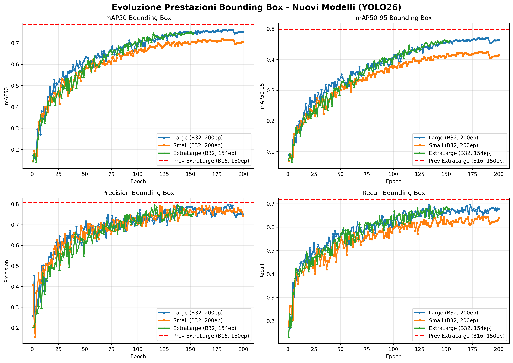
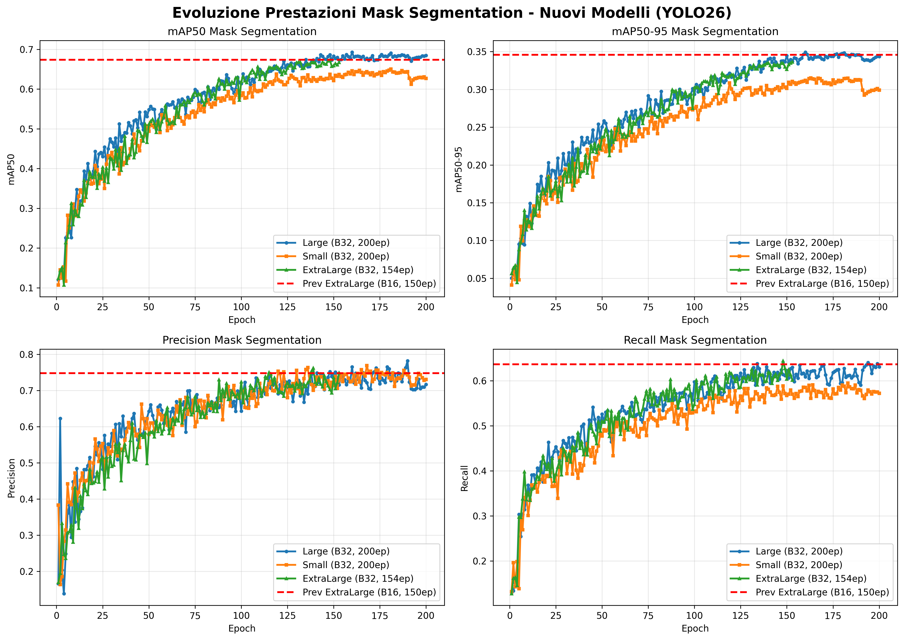
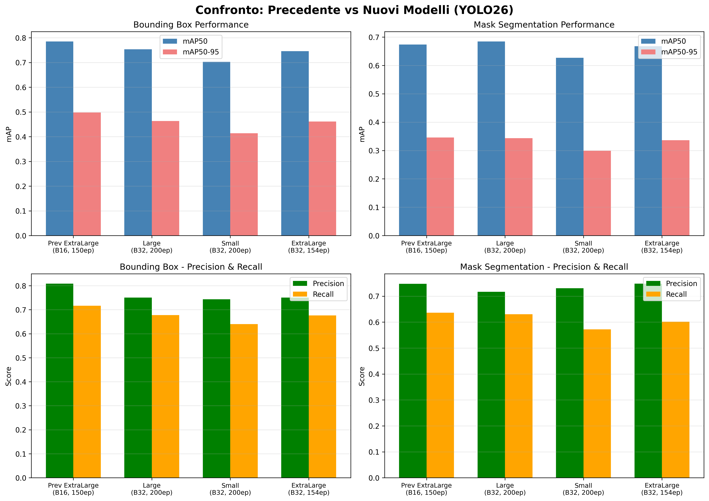

## Modelli object detection e mask segmentation su dataset pomodori (YOLO26)

Nel seguente progetto sono stati sviluppati nuovi modelli di riconoscimento e segmentazione su dataset di pomodori utilizzando **YOLO26** con architetture di diverse dimensioni (small, large, extraLarge) addestrate su **200 epoche** e **batch size 32**. 

I modelli precedenti sviluppati con YOLO26 addestrati su 150 epoche si possono trovare [qui](versioniPrecedenti/runs/segment26).

### Miglioramenti rispetto alla versione precedente

I nuovi modelli sono stati addestrati con i seguenti **parametri principali**:

| Parametro | Versione Attuale | Versione Precedente |
|:---------|:----------:|:----------:|
| **Epoche** | 200 | 150 |
| **Batch Size** | 32 | 16 (ExtraLarge) / 64 (Large) |
| **Image Size** | 640 | 448 (ExtraLarge) / 640 (Large) |
| **Learning Rate Schedule** | cos_lr: True | cos_lr: False |
| **Cache** | True | False |
| **Dataset** | datasetAggiornato | datasetPomodori |

Inoltre, è stata aggiunta la **cosine annealing learning rate** (cos_lr) che aiuta a migliorare la convergenza del modello durante l'allenamento, e il **caching del dataset** per velocizzare il caricamento delle immagini.

### Evoluzione delle metriche durante l'addestramento

Nel seguente grafico vediamo l'evoluzione delle metriche di **Bounding Box** durante i 200 epoch di addestramento. Possiamo notare che il modello **Large** mantiene prestazioni stabili e coerenti, mentre il modello **Small** mostra una convergenza leggermente inferiore.

Nel seguente grafico invece vediamo l'evoluzione delle metriche di **Mask Segmentation**, che mostrano come il modello Large sia significativamente più bravo nel predire i contorni precisi della maschera rispetto agli altri modelli.

### Risultati finali dei modelli

Nella tabella seguente visualizziamo le metriche finali riguardo le **bounding box** sui modelli nuovi, confrontati con il miglior modello della versione precedente:

| Modello     |   mAP50 |   mAP50-95 |   Precision |   Recall |   
|:------------|--------:|-----------:|------------:|---------:|
| **YOLO26l_B32_200ep** | **0.753** |      **0.464** |     **0.750** |    **0.677** |
| YOLO26s_B32_200ep |   0.703 |      0.414 |       0.743 |    0.640 |
| YOLO26x_B32_154ep |   0.749 |      0.461 |       0.721 |    0.664 |
| *Prev: YOLO26x_B16_150ep* | *0.785* |      *0.498* |     *0.809* |    *0.716* |

Come si vede dalla tabella, il modello **Large con batch 32 su 200 epoche** è il migliore tra i nuovi modelli, anche se non supera completamente il precedente ExtraLarge (batch 16). Tuttavia, va notato che il modello precedente:
- Utilizzava un batch size più piccolo (16 vs 32), che comporta gradienti più rumorosi
- Aveva un image size più piccolo (448 vs 640)
- Non utilizzava cosine annealing per il learning rate

Nella tabella seguente invece abbiamo le metriche riguardo le **maschere di segmentazione**:

| Modello     |   mAP50 |   mAP50-95 |   Precision |   Recall |
|:------------|--------:|-----------:|------------:|---------:|
| **YOLO26l_B32_200ep** | **0.685** |    **0.344** |       **0.717** |    **0.636** |
| YOLO26s_B32_200ep |   0.629 |      0.297 |       0.738 |    0.576 |
| YOLO26x_B32_154ep |   0.667 |      0.335 |       0.748 |    0.602 |
| *Prev: YOLO26x_B16_150ep* | *0.674* |      *0.346* |     *0.748* |    *0.636* |

In questa metrica il modello Large è rimasto leggermente indietro rispetto al precedente ExtraLarge, ma è comunque competitivo. La differenza principale è che il modello ExtraLarge ha una maggiore capacità di rete, il che comporta un numero maggiore di parametri.

### Visualizzazione comparativa

Nel seguente grafico vediamo un confronto visuale tra il miglior modello nuovo (Large B32) e il miglior modello precedente:

### Spiegazione delle metriche

Le metriche utilizzate rappresentano:

- **mAP50**, *mean Average Precision 50*, è la precisione media calcolata con una soglia di sovrapposizione del 50% tra la predizione del modello e l'oggetto reale. Ci dice se il sistema è in grado di visualizzare l'oggetto cercato.

- **mAP50-95**, è la media della precisione calcolata su diverse soglie di rigore che vanno dal 50% al 95%. Ci dice quanto è bravo il modello nel predire i contorni dell'oggetto.

- **Precision**, indica la capacità di non generare falsi positivi, è data dal rapporto:  $$\frac{True Positives}{True Positives + False Positives} $$

- **Recall**, indica la capacità di individuare tutti gli oggetti presenti, è dato dal rapporto:
 $$\frac{True Positives}{True Positives + False Negatives} $$

### Stato dei modelli

Attualmente sono stati addestrati i seguenti modelli:

- ✅ **Large (B32, 200 epoche)** - Completamente addestrato
- ✅ **Small (B32, 200 epoche)** - Completamente addestrato  
- ⏳ **ExtraLarge (B32, 154 epoche)** - Addestramento interrotto (sarà completato a 200 epoche)
- ⏳ **Medium (B32)** - Addestramento da completare

Il modello **Large** risulta essere il migliore tra i nuovi modelli addestrati, con prestazioni stabili su entrambe le metriche di bounding box e mask segmentation.

### Dataset

Per l'adattamento del dataset di addestramento [datasetAggiornato](datasetAggiornato) è stato utilizzato [roboflow](https://roboflow.com/).
