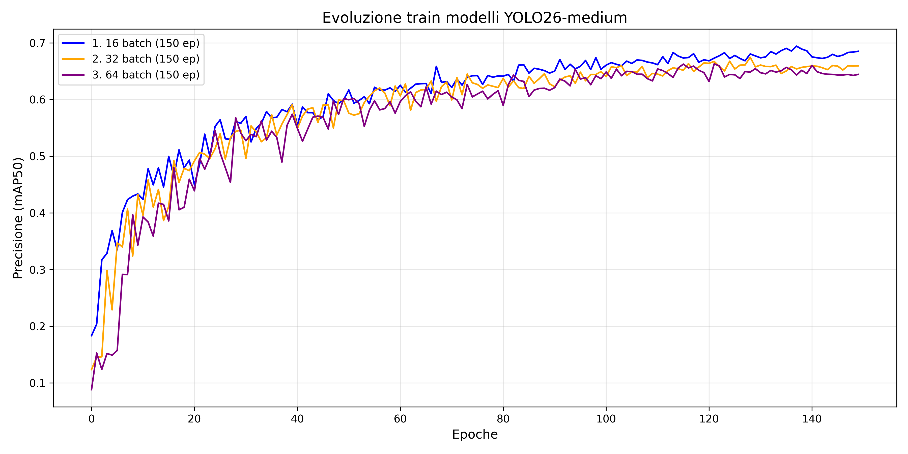

## Modelli object detection e mask segmentation su dataset pomodori 

Sviluppati nuovi modelli su più epoche (100/150) e usando versioni di yolo più potenti (come large e extralarge). 
I primi modelli si possono trovare [qui](runs/segment0). (anche se sono peggiori rispetto a quelli nuovi)

Oltre alle varie versioni dei modelli abbiamo tenuto conto del _batch size_, che ha un impatto importante sulle metriche di precisione.

In questo grafico vediamo 3 modelli addestrati su diverse versioni di YOLO11, rispettivamente medium, large ed extralarge.  
Il quarto modello invece è una versione _ibrida_ in cui viene modificata l'architettura della versione medium. La modifica è stata effettuata a livello di _backbone_, inserendo un modulo di attenzione C2PSA, che teoricamente avrebbe dovuto far diminuire il numero di falsi positivi ed aumentare la precisione soprattutto a livello di mask-segmentation. In realtà non ha funzionato come previsto, ma potrebbe essere un'idea da sviluppare meglio. Il modello ibrido e l'extralarge sono addestrati con batch size di 32, medium e large con batch size di 64. 

Abbiamo modelli della stessa versione di YOLO, ad esempio YOLO11-medium, addestrati su diverse scelte di batch (16, 32 e 64).

Possiamo notare nel grafico qui sotto come la precisione (mAP) di modelli addestrati con YOLO26-medium cambi a seconda del batch_size scelto. 

Qui vediamo un confronto quantitativo su diverse metriche, tra i 3 modelli qui sopra, utilizzando il modello sul dataset di test, ottenendo così stime sensate, in quanto
lavora su immagini che non aveva mai visto prima.

Qui visualizziamo le metriche riguardo le bounding box:

| Modello     |   mAP50 |   mAP50-95 |   Precision |   Recall |   
|:------------|--------:|-----------:|------------:|---------:|
| YOLO26m_B16 | *0.808* |      0.498 |     *0.827* |    0.737 |
| YOLO26m_B32 |   0.793 |      0.509 |       0.78  | *0.740*  |
| YOLO26m_B64 |   0.798 |    *0.512* |       0.804 |    0.711 |

In questa tabella invece abbiamo le metriche riguardo le maschere di segmentazione:

| Modello     |   mAP50 |   mAP50-95 |   Precision |   Recall |
|:------------|--------:|-----------:|------------:|---------:|
| YOLO26m_B16 |   0.669 |      0.293 |     *0.732* |  *0.671* |
| YOLO26m_B32 | *0.672* |    *0.295* |       0.708 |    0.67  |
| YOLO26m_B64 |   0.667 |      0.29  |       0.722 |    0.634 |

Notiamo che in realtà, in questo caso almeno, che non c'è una grande variazione tra i modelli della stessa versione usando un batch differente.

Le metriche utilizzate rappresentano:
 - mAP50, _mean Average Precision 50_, è la precisione media calcolata con una soglia di sovrapposizine del 50% tra la predizione del modello e l'oggetto reale. Ci dice se il sistema è in grade di visualizzare l'oggetto cercato.
 - mAPA50-95, è la media della precisione calcolata su diverse soglie di rigore che vanno dal 50% al 95%. Ci dice quanto è bravo il modello nel predire i contorni dell'oggetto.
 - Precision, indica la capacità di non generare falsi positivi, è data dal rapporto:  $$\frac{True Positives}{True Positives + False Positives} $$
 - Recall, indica la capacità di individuare tutti gli oggetti presenti, è dato dal rapporto:
 $$\frac{True Positives}{True Positives + False Negatives} $$

Qui vediamo invece come varia la precisione dei modelli addestrati con YOLO26-large

In questo grafico confrontiamo la versione migliore di YOLO11 e la versione migliore di YOLO26, dove con migliore intendiamo quella che ha ottenuto una precisione più alta sul nostro dataset di validazione.

Per l'adattamento del dataset di addestramento [datasetPomdori](datasetPomodori) è stato utilizzato [roboflow](https://roboflow.com/).
