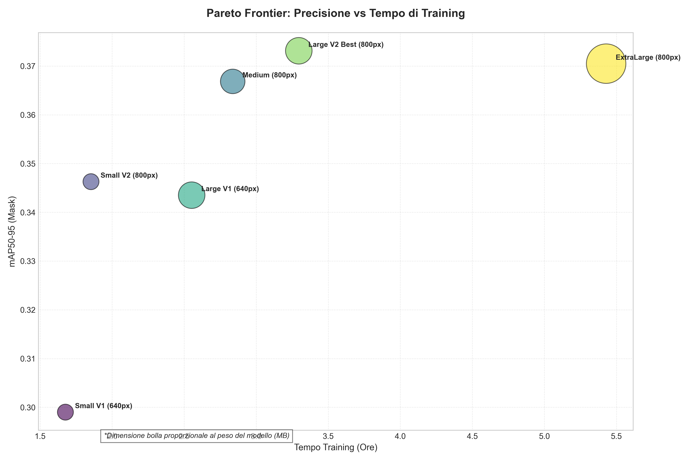

## Modelli Object Detection e Mask Segmentation su Dataset Pomodori (YOLO26)

Questo progetto documenta lo sviluppo e l'addestramento di modelli di visione artificiale ottimizzati per il riconoscimento e la segmentazione di istanze di pomodori. Sono state impiegate architetture **YOLO26** di diverse scale per bilanciare latenza e precisione in contesti robotici.

### Evoluzione della Sperimentazione
Le fasi di addestramento sono state divise in due generazioni principali:
1. **Generazione V1 (640px)**: Baseline standard di YOLO.
2. **Generazione V2 (800px)**: Ottimizzazione della risoluzione di input, fondamentale per risolvere dettagli in scene con occlusioni, unita all'uso di **Retina Masks** per la massima precisione dei contorni.

Entrambe le generazioni beneficiano della **Cosine Annealing Learning Rate (cos_lr)** per una convergenza stabile.

### Risultati Comparativi (Dataset Aggiornato)
I modelli sono stati valutati su 200 epoche. Il confronto evidenzia come l'incremento della risoluzione (V2) porti a un salto di qualità trasversale a tutte le architetture.

| Modello | Imgsz | mAP50 (B) | mAP50-95 (B) | mAP50 (M) | mAP50-95 (M) | Precision (M) | Recall (M) |
| :--- | :--- | :--- | :--- | :--- | :--- | :--- | :--- |
| **Small V1** | 640 | 0.703 | 0.414 | 0.627 | 0.299 | 0.730 | 0.572 |
| **Small V2** | **800** | 0.736 | 0.451 | 0.663 | 0.346 | 0.728 | 0.636 |
| **Medium** | 800 | 0.767 | 0.477 | 0.700 | 0.367 | 0.755 | 0.645 |
| **Large V1** | 640 | 0.754 | 0.464 | 0.685 | 0.344 | 0.717 | 0.631 |
| **Large V2 (Best)** | **800** | **0.778** | **0.491** | **0.712** | **0.373** | **0.762** | **0.670** |
| **ExtraLarge** | 800 | 0.775 | 0.485 | 0.711 | 0.370 | 0.737 | 0.667 |

*(B) = Bounding Box, (M) = Segmentation Mask. Valutazioni eseguite con confidenza 0.20.*

#### Evoluzione delle Metriche (mAP@.50:.95)

*Figura 1: Evoluzione della precisione media (mAP50-95) per le Bounding Box.*

*Figura 2: Evoluzione della precisione media (mAP50-95) per le Maschere di Segmentazione.*

### Analisi Tecnica
1. **L'impatto della Risoluzione (V1 vs V2)**: Il passaggio da x640 a 800 pixel è il fattore determinante. Il modello **Small V2** (800px) riesce a superare le prestazioni del **Large V1** (640px) pur avendo un numero di parametri significativamente inferiore, a dimostrazione che la densità di pixel è critica per la segmentazione in questo dominio.
2. **Equilibrio Architetturale**: Il modello **Large V2 (800px)** rappresenta l'ottimo di Pareto: offre prestazioni superiori alla versione ExtraLarge (XL) con una complessità ridotta, confermando che l'architettura Large ha già la capacità necessaria per il dataset attuale.

### Analisi della Convergenza e Generalizzazione
L'analisi delle curve evidenzia una robusta capacità di generalizzazione:
- **Assenza di Overfitting**: La stabilità della loss di validazione conferma che i modelli non hanno "memorizzato" il training set.
- **Ottimizzazione**: L'impiego del Cosine Annealing ha stabilizzato la precisione finale al valore massimo (0.373 mAP50-95 per le maschere nel modello Large V2).

*Figura 3: Analisi della convergenza tramite Validation Segmentation Loss.*

### Validazione Finale su Test Set (Unbiased Evaluation) (confidence di 0.2)
I modelli V2 (800px) sono stati valutati su un Test Set indipendente.

| Modello            |   Box mAP50 |   Box mAP50-95 |   Mask mAP50 |   Mask mAP50-95 |   Precision (M) |   Recall (M) |
|:-------------------|------------:|---------------:|-------------:|----------------:|----------------:|-------------:|
| Small V2 (800px)   |       0.764 |          0.491 |        0.697 |           0.369 |           0.743 |        0.625 |
| Medium (800px)     |       0.793 |          0.522 |        0.739 |           0.388 |           0.729 |        0.688 |
| Large V2 (800px)   |       0.796 |          0.531 |        0.737 |           0.395 |           0.726 |        0.671 |
| **ExtraLarge (800px)** |       **0.812** |          **0.539** |        **0.753** |           **0.397** |           **0.758** |        **0.691** |

### Validazione su Test Set nuovi modelli (Unbiased Evaluation)
Nuovi modelli addestrati sul dataset originale e successivamente testati sul dataset di test aggiornato. 

| Modello            |   Box mAP50 |   Box mAP50-95 |   Mask mAP50 |   Mask mAP50-95 |   Precision (M) |   Recall (M) |
|:-------------------|------------:|---------------:|-------------:|----------------:|----------------:|-------------:|
| Small (800px)      |       0.768 |          0.5   |        0.711 |           0.38  |           0.671 |        0.687 |
| Medium (800px)     |       0.771 |          0.519 |        0.718 |           0.395 |           0.713 |        0.652 |
| Large (800px)      |       0.799 |          0.535 |        0.737 |           0.396 |           0.712 |        0.698 |
| ExtraLarge (800px) |       0.796 |          0.539 |        0.722 |           0.399 |           0.731 |        0.683 |

Validazione effettuata con una confidenza di 0.2 per tutti i modelli. 
Il modello xl addestrato sul dataset aggiornato risulta essere comunque più efficiente degli altri sullo stesso dataset di test.

### Validazione su tutti i modelli, effettuata con una confidenza di 0.3:
| Modello                    |   Box mAP50 |   Box mAP50-95 |   Mask mAP50 |   Mask mAP50-95 |   Precision (M) |   Recall (M) |
|:---------------------------|------------:|---------------:|-------------:|----------------:|----------------:|-------------:|
| Small NewData (800px)      |       0.76  |          0.496 |        0.696 |           0.377 |           0.736 |        0.629 |
| Medium NewData (800px)     |       0.787 |          0.524 |        0.734 |           0.395 |           0.736 |        0.682 |
| Large NewData (800px)      |       0.786 |          0.532 |        0.731 |           0.404 |           0.734 |        0.668 |
| ExtraLarge NewData (800px) |       0.804 |          0.539 |        0.747 |           0.405 |           0.758 |        0.691 |
| Small OldData (800px)      |       0.752 |          0.499 |        0.7   |           0.382 |           0.734 |        0.624 |
| Medium OldData (800px)     |       0.766 |          0.52  |        0.716 |           0.399 |           0.731 |        0.645 |
| Large OldData (800px)      |       0.79  |          0.534 |        0.73  |           0.398 |           0.733 |        0.678 |
| ExtraLarge OldData (800px) |       0.792 |          0.542 |        0.722 |           0.403 |           0.73  |        0.685 |

### Validazione su tutti i modelli, effettuata con una confidenza di 0.4:
| Modello                    |   Box mAP50 |   Box mAP50-95 |   Mask mAP50 |   Mask mAP50-95 |   Precision (M) |   Recall (M) |
|:---------------------------|------------:|---------------:|-------------:|----------------:|----------------:|-------------:|
| Small NewData (800px)      |       0.74  |          0.493 |        0.682 |           0.379 |           0.786 |        0.567 |
| Medium NewData (800px)     |       0.77  |          0.521 |        0.722 |           0.397 |           0.787 |        0.626 |
| Large NewData (800px)      |       0.778 |          0.532 |        0.724 |           0.407 |           0.78  |        0.628 |
| ExtraLarge NewData (800px) |       0.796 |          0.541 |        0.743 |           0.408 |           0.778 |        0.674 |
| Small OldData (800px)      |       0.746 |          0.499 |        0.697 |           0.386 |           0.787 |        0.587 |
| Medium OldData (800px)     |       0.751 |          0.515 |        0.705 |           0.398 |           0.768 |        0.595 |
| Large OldData (800px)      |       0.775 |          0.533 |        0.719 |           0.399 |           0.787 |        0.621 |
| ExtraLarge OldData (800px) |       0.779 |          0.54  |        0.713 |           0.403 |           0.761 |        0.648 |

### Validazione su tutti i modelli, effettuata con una confidenza di 0.5:
| Modello                    |   Box mAP50 |   Box mAP50-95 |   Mask mAP50 |   Mask mAP50-95 |   Precision (M) |   Recall (M) |
|:---------------------------|------------:|---------------:|-------------:|----------------:|----------------:|-------------:|
| Small NewData (800px)      |       0.716 |          0.484 |        0.66  |           0.377 |           0.812 |        0.496 |
| Medium NewData (800px)     |       0.752 |          0.515 |        0.706 |           0.393 |           0.811 |        0.574 |
| Large NewData (800px)      |       0.761 |          0.527 |        0.714 |           0.409 |           0.836 |        0.576 |
| ExtraLarge NewData (800px) |       0.781 |          0.539 |        0.729 |           0.408 |           0.822 |        0.619 |
| Small OldData (800px)      |       0.722 |          0.495 |        0.675 |           0.387 |           0.837 |        0.508 |
| Medium OldData (800px)     |       0.741 |          0.516 |        0.696 |           0.399 |           0.814 |        0.549 |
| Large OldData (800px)      |       0.761 |          0.531 |        0.706 |           0.399 |           0.823 |        0.572 |
| ExtraLarge OldData (800px) |       0.757 |          0.531 |        0.694 |           0.4   |           0.805 |        0.581 |

### Validazione su tutti i modelli, effettuata con una confidenza di 0.7:
Tabella Markdown per il README:
| Modello                    |   Box mAP50 |   Box mAP50-95 |   Mask mAP50 |   Mask mAP50-95 |   Precision (M) |   Recall (M) |
|:---------------------------|------------:|---------------:|-------------:|----------------:|----------------:|-------------:|
| Small NewData (800px)      |       0.661 |          0.471 |        0.625 |           0.377 |           0.888 |        0.357 |
| Medium NewData (800px)     |       0.706 |          0.503 |        0.667 |           0.389 |           0.885 |        0.442 |
| Large NewData (800px)      |       0.707 |          0.508 |        0.667 |           0.4   |           0.886 |        0.435 |
| ExtraLarge NewData (800px) |       0.71  |          0.514 |        0.671 |           0.397 |           0.892 |        0.444 |
| Small OldData (800px)      |       0.66  |          0.474 |        0.62  |           0.378 |           0.882 |        0.351 |
| Medium OldData (800px)     |       0.688 |          0.496 |        0.655 |           0.392 |           0.881 |        0.414 |
| Large OldData (800px)      |       0.697 |          0.506 |        0.653 |           0.387 |           0.874 |        0.417 |
| ExtraLarge OldData (800px) |       0.701 |          0.512 |        0.646 |           0.396 |           0.859 |        0.43  |

Si può notare subito che aumentando la confidence, per tutti i modelli risulta che l'mAP e la recall diminuiscono mentre la precision aumenta. 
Notiamo anche che con una confidence abbastanza alta (0.7) non c'è più una grande differenza tra i valori ottenuti tra i vari modelli, l'xl sul dataset nuovo è ancora il migliore,
ma risulta migliore solo di qualche centesimo rispetto agli altri (large e medium), mentre con una confidence più bassa c'era una differenza di qualche decimo. 

Si nota come tutti i modelli mantengano prestazioni elevate su dati mai visti, con il modello **ExtraLarge** che supera la soglia dell'**81% di mAP50 per le Bounding Box** e il **75% per le Segmentation Mask**. La stabilità delle metriche tra i diversi modelli suggerisce che la risoluzione a 800px sia il fattore abilitante per un riconoscimento affidabile in questo dominio.

### Analisi dell'Efficienza e Costo Computazionale
| Modello | Peso (MB) | Tempo Training | mAP50-95 (Mask) | Efficienza |
| :--- | :--- | :--- | :--- | :--- |
| **Small V1** | 22 MB | 1h 40m | 0.299 | Baseline Small |
| **Small V2** | 22 MB | 1h 51m | 0.346 | **Alta Efficienza** |
| **Medium** | 52 MB | 2h 50m | 0.367 | Ottimo bilanciamento |
| **Large V1** | 61 MB | 2h 33m | 0.344 | Superato dai modelli V2 |
| **Large V2** | 61 MB | 3h 17m | **0.373** | **Best Performance** |
| **ExtraLarge** | 135 MB | 5h 25m | 0.370 | Inefficiente |

*Figura 4: Analisi di efficienza. La dimensione della bolla rappresenta il peso del modello in MB.*

### Glossario delle Metriche
- **mAP50-95**: Metrica rigorosa che valuta la precisione millimetrica dei contorni.
- **Precision/Recall**: Capacità di evitare falsi positivi e individuare tutti gli oggetti.

### Dataset e Strumenti
Dataset gestito via [Roboflow](https://roboflow.com/). Log completi in `runs/segment/`.
