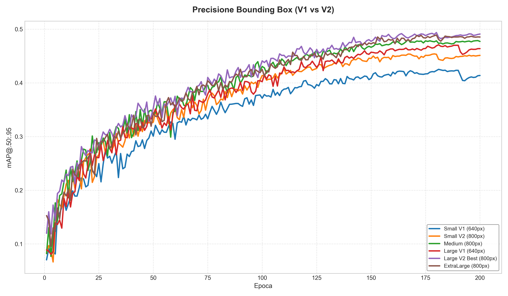
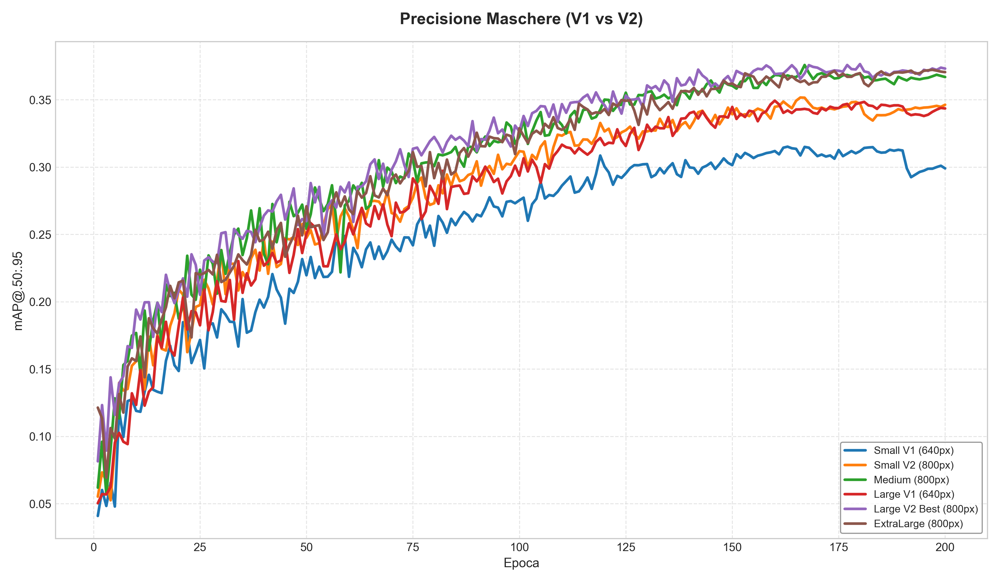
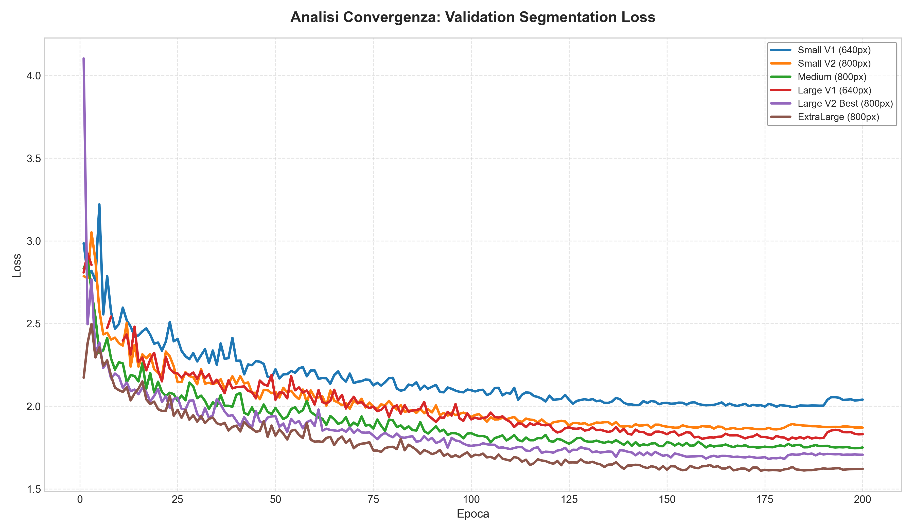
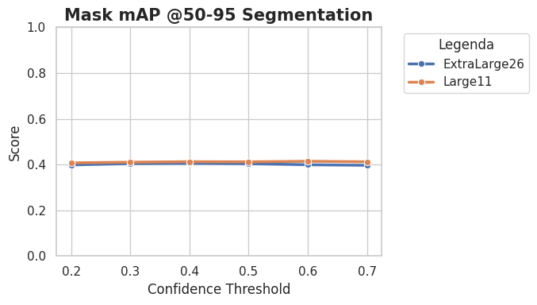
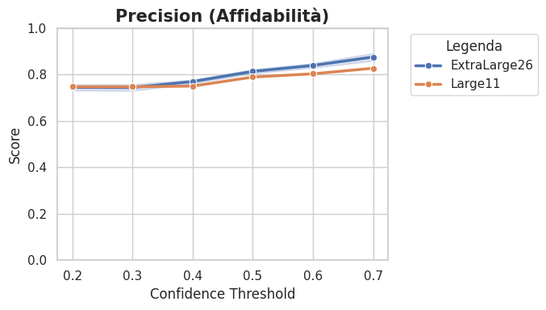
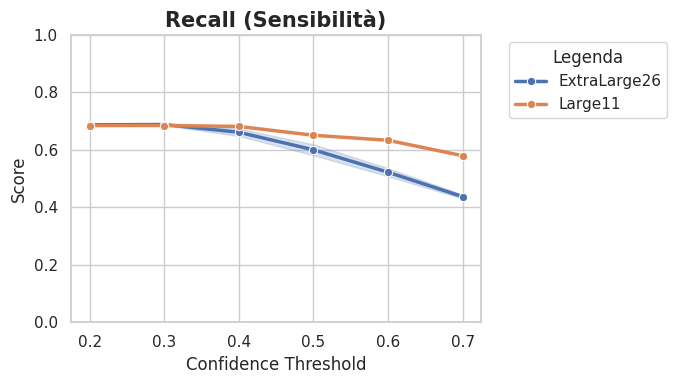
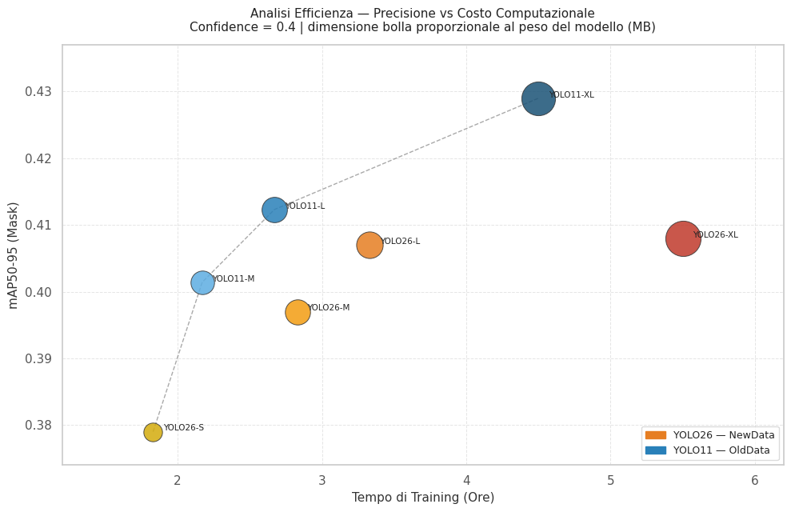
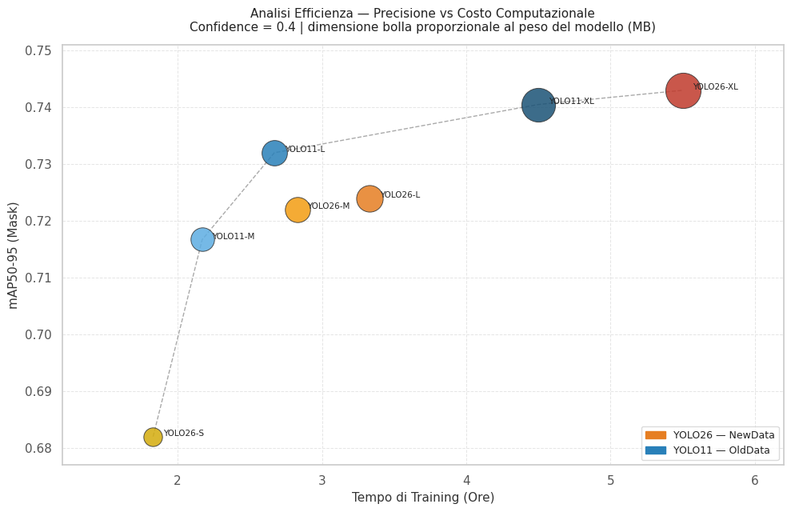

## Modelli Object Detection e Mask Segmentation su Dataset Pomodori (YOLO26)

Questo progetto documenta lo sviluppo e l'addestramento di modelli di visione artificiale ottimizzati per il riconoscimento e la segmentazione di istanze di pomodori. Sono state impiegate architetture **YOLO** (YOLO11 e YOLO26) di diverse scale per bilanciare latenza e precisione in contesti robotici.

### Evoluzione della Sperimentazione
Le fasi di addestramento sono state divise in due generazioni principali:
1. **Generazione V1 (640px)**: Baseline standard di YOLO.
2. **Generazione V2 (800px)**: Ottimizzazione della risoluzione di input, fondamentale per risolvere dettagli in scene con occlusioni, unita all'uso di **Retina Masks** per la massima precisione dei contorni.

Entrambe le generazioni beneficiano della **Cosine Annealing Learning Rate (cos_lr)** per una convergenza stabile.

### Risultati Comparativi (Dataset Aggiornato)
I modelli sono stati valutati su 200 epoche. Il confronto evidenzia come l'incremento della risoluzione (V2) porti a un salto di qualità trasversale a tutte le architetture.

| Modello | Imgsz | mAP50 (B) | mAP50-95 (B) | mAP50 (M) | mAP50-95 (M) | Precision (M) | Recall (M) |
| :--- | :--- | :--- | :--- | :--- | :--- | :--- | :--- |
| **Small V1** | 640 | 0.703 | 0.414 | 0.627 | 0.299 | 0.730 | 0.572 |
| **Small V2** | **800** | 0.736 | 0.451 | 0.663 | 0.346 | 0.728 | 0.636 |
| **Medium** | 800 | 0.767 | 0.477 | 0.700 | 0.367 | 0.755 | 0.645 |
| **Large V1** | 640 | 0.754 | 0.464 | 0.685 | 0.344 | 0.717 | 0.631 |
| **Large V2 (Best)** | **800** | **0.778** | **0.491** | **0.712** | **0.373** | **0.762** | **0.670** |
| **ExtraLarge** | 800 | 0.775 | 0.485 | 0.711 | 0.370 | 0.737 | 0.667 |

*(B) = Bounding Box, (M) = Segmentation Mask. Valutazioni eseguite con confidenza 0.20.*

#### Evoluzione delle Metriche (mAP@.50:.95)

*Figura 1: Evoluzione della precisione media (mAP50-95) per le Bounding Box.*

*Figura 2: Evoluzione della precisione media (mAP50-95) per le Maschere di Segmentazione.*

### Analisi Tecnica
1. **L'impatto della Risoluzione (V1 vs V2)**: Il passaggio da x640 a 800 pixel è il fattore determinante. Il modello **Small V2** (800px) riesce a superare le prestazioni del **Large V1** (640px) pur avendo un numero di parametri significativamente inferiore, a dimostrazione che la densità di pixel è critica per la segmentazione in questo dominio.
2. **Equilibrio Architetturale**: Il modello **Large V2 (800px)** rappresenta l'ottimo di Pareto: offre prestazioni superiori alla versione ExtraLarge (XL) con una complessità ridotta, confermando che l'architettura Large ha già la capacità necessaria per il dataset attuale.

### Analisi della Convergenza e Generalizzazione
L'analisi delle curve evidenzia una robusta capacità di generalizzazione:
- **Assenza di Overfitting**: La stabilità della loss di validazione conferma che i modelli non hanno "memorizzato" il training set.
- **Ottimizzazione**: L'impiego del Cosine Annealing ha stabilizzato la precisione finale al valore massimo (0.373 mAP50-95 per le maschere nel modello Large V2).

*Figura 3: Analisi della convergenza tramite Validation Segmentation Loss.*

### Validazione Finale su Test Set (Unbiased Evaluation) con una confidenza di 0.4:

I modelli sono stati valutati su un test set indipendente con confidenza fissata a 0.4, per una stima unbiased delle performance reale.

| Modello                    |   Box mAP50 |   Box mAP50-95 |   Mask mAP50 |   Mask mAP50-95 |   Precision (M) |   Recall (M) |
|:---------------------------|------------:|---------------:|-------------:|----------------:|----------------:|-------------:|
| Small NewData (800px)      |       0.74  |          0.493 |        0.682 |           0.379 |           0.786 |        0.567 |
| Medium NewData (800px)     |       0.77  |          0.521 |        0.722 |           0.397 |           0.787 |        0.626 |
| Large NewData (800px)      |       0.778 |          0.532 |        0.724 |           0.407 |           0.78  |        0.628 |
| **ExtraLarge NewData (800px)** |       **0.796** |          **0.541** |        **0.743** |           0.408 |           0.778 |        0.674 |
| Small OldData (800px)      |       0.746 |          0.499 |        0.697 |           0.386 |           0.787 |        0.587 |
| Medium OldData (800px)     |       0.751 |          0.515 |        0.705 |           0.398 |           0.768 |        0.595 |
| Large OldData (800px)      |       0.775 |          0.533 |        0.719 |           0.399 |           0.787 |        0.621 |
| ExtraLarge OldData (800px) |       0.779 |          0.54  |        0.713 |           0.403 |           0.761 |        0.648 |
| ExtraLarge 11 (800px)      |       0.803 |          0.576 |        0.738 |           0.411 |            0.76 |        0.688 |
| Medium 11  (640px)   | 0.7957 |         0.5615 |       0.7167 |          0.4014 |      0.7226 |   0.6567 |
| **Large 11 (640px)** |      **0.8068** |         **0.5719** |       **0.732**  |          **0.4123** |      **0.75**   |   **0.6813** |
| ExtraLarge 11 (640px)|      0.8028 |         0.5756 |       0.7405 |          0.429  |      0.7594 |   0.6896 |

In [risultati](risultati.csv) troviamo tutti i valori ottenuti su vari livelli di confidence (da 0.2 a 0.7).

Nonostante YOLO26 sia l'architettura più recente e teoricamente più performante, il modello **Large di YOLO11** ottiene performance molto simili, e migliori su alcune metriche, rispetto all'ExtraLarge di YOLO26.

  

I grafici evidenziano tre aspetti principali:
- **mAP50-95**: i due modelli sono sostanzialmente equivalenti su tutti i valori di confidence; 
- **Precision**: YOLO26-XL raggiunge una precisione più elevata ad alta confidence, vicina al 90%, mentre YOLO11-L è più contenuto, ma non c'è una differenza così netta;
- **Recall**: YOLO11-L mantiene una recall significativamente più stabile all'aumentare della confidence, mentre YOLO26-XL diminuisce drasticamente.

La stabilità delle metriche al variare della confidence è un punto di forza per applicazioni reali: consente di adattare la soglia in base al caso d'uso — ad esempio privilegiare la recall per raccogliere il maggior numero di pomodori, o la precision per evitare falsi positivi in raccolta automatizzata.

### Analisi dell'Efficienza e Costo Computazionale mAP50-95 (Mask)
| Modello | Peso (MB) | Tempo Training | mAP50-95 (Mask) | Efficienza |
| :--- | :--- | :--- | :--- | :--- |
| **YOLO26-S NewData** | 23.4 MB | ~1h 50m | 0.379 | Alta Efficienza |
| **YOLO11-M OldData** | 45.2 MB | ~2h 10m | 0.401 | Ottimo bilanciamento |
| **YOLO11-L OldData** | 55.8 MB | ~2h 40m | 0.412 |  **Best Performance** |
| **YOLO26-M NewData** | 54.5 MB | ~2h 50m | 0.397 | Buona efficienza |
| **YOLO26-L NewData** | 63.5 MB | ~3h 20m | 0.407 | Superato da YOLO11-L |
| **YOLO11-XL OldData** | 124.8 MB | ~4h 30m | **0.429** | Inefficiente |
| **YOLO26-XL NewData** | 141.8 MB | ~5h 30m | 0.408 | Inefficiente |

*Figura 4: Analisi di efficienza. La dimensione della bolla rappresenta il peso del modello in MB.*

### Analisi dell'Efficienza e Costo Computazionale mAP50 (Mask)
| Modello | Peso (MB) | Tempo Training | mAP50 (Mask) | Efficienza |
| :--- | :--- | :--- | :--- | :--- |
| **YOLO26-S NewData** | 23.4 MB | 1h 50m | 0.682 | Alta Efficienza |
| **YOLO11-M OldData** | 45.2 MB | 2h 10m | 0.717 | Buona Efficienza |
| **YOLO11-L OldData** | 55.8 MB | 2h 40m | 0.732 | **Best Performance** |
| **YOLO26-M NewData** | 54.5 MB | 2h 50m | 0.722 | Ottimo bilanciamento |
| **YOLO26-L NewData** | 63.5 MB | 3h 20m | 0.724 |  Superato da YOLO11-L |
| **YOLO11-XL OldData** | 124.8 MB | 4h 30m | 0.741 | Inefficiente |
| **YOLO26-XL NewData** | 141.8 MB | 5h 30m | **0.743** | **Inefficiente** |

In entrambe le metriche emerge lo stesso risultato: i modelli ExtraLarge sono i migliori a livello di precisione assoluta, YOLO11-XL per mAP50-95 e YOLO26-XL per mAP50, ma entrambi risultano inefficienti in termini di peso e tempo di training. Il miglior compromesso è **YOLO11-L**, che con un tempo di addestramento contenuto (~2h 40m) e un peso di 55.8 MB raggiunge performance elevate su entrambe le metriche.

### Algoritmo di Reachability e Ranking (reachability_ranking.py)
Per tradurre le rilevazioni di YOLO in decisioni azionabili per un sistema robotico, è stato implementato un modulo di **Reachability Analysis** basato sulla geometria delle maschere di segmentazione.

#### Logica di Funzionamento
L'algoritmo elabora i risultati dell'inferenza (frame 448x448) seguendo questi step:
1. **Estrazione Maschere**: Recupera le maschere binarie per la classe `tomato` e le normalizza alla risoluzione nativa del frame.
2. **Calcolo Area e Centroide**: Determina l'area reale in pixel (somma dei pixel attivi) e il centro geometrico di ogni istanza. L'area viene utilizzata come *proxy* della distanza e dell'occlusione.
3. **Ranking Dinamico**: Ordina tutti i pomodori rilevati in base all'area decrescente e seleziona i **Top 3** candidati. Questo riduce il carico computazionale per la pianificazione delle traiettorie del robot, focalizzandosi solo sui target più promettenti.
4. **Criterio di Raggiungibilità**:
   - **Target Valido (Verde)**: Area > 2000 pixel. Indica un pomodoro sufficientemente grande/vicino per un tentativo di presa sicuro.
   - **Target Lontano/Piccolo (Rosso)**: Area < 2000 pixel. Il sistema identifica il frutto ma lo segnala come non prioritario o fuori portata ottimale.

#### Utilità Robotica
Questa euristica fornisce una **baseline solida** per il filtraggio dei target prima dell'invio delle coordinate al controller del braccio robotico, garantendo che il sistema interagisca solo con oggetti che presentano un segnale visivo robusto e una dimensione apparente compatibile con le specifiche operative del gripper.

### Glossario delle Metriche
- **mAP50-95**: Metrica rigorosa che valuta la precisione millimetrica dei contorni.
- **Precision/Recall**: Capacità di evitare falsi positivi e individuare tutti gli oggetti.

### Dataset e Strumenti
Dataset gestito via [Roboflow](https://roboflow.com/). Log completi in `runs/segment/`.
