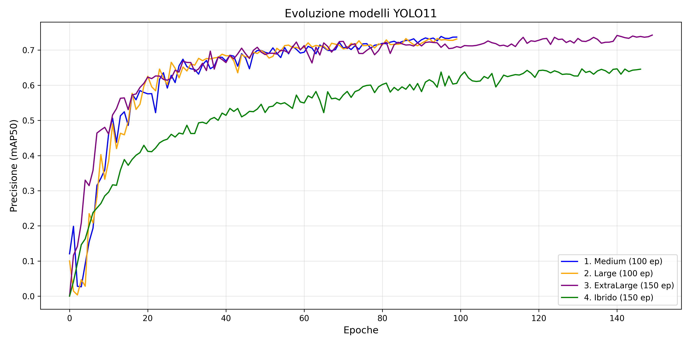
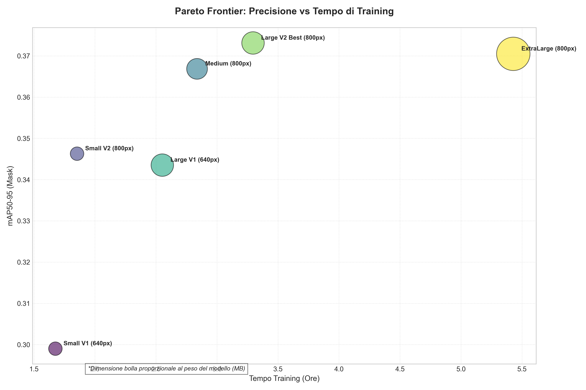

## Modelli object detection e mask segmentation su dataset pomodori 

Sviluppati nuovi modelli su più epoche (100/150) e usando versioni di yolo più potenti (come large e extralarge). 
I primi modelli si possono trovare [qui](runs/segment0). (anche se sono peggiori rispetto a quelli nuovi)

Oltre alle varie versioni dei modelli abbiamo tenuto conto del _batch size_, che ha un impatto importante sulle metriche di precisione.

In questo grafico vediamo 3 modelli addestrati su diverse versioni di YOLO11, rispettivamente medium, large ed extralarge.  
Il quarto modello invece è una versione _ibrida_ in cui viene modificata l'architettura della versione medium. La modifica è stata effettuata a livello di _backbone_, inserendo un modulo di attenzione C2PSA, che teoricamente avrebbe dovuto far diminuire il numero di falsi positivi ed aumentare la precisione soprattutto a livello di mask-segmentation. In realtà non ha funzionato come previsto, ma potrebbe essere un'idea da sviluppare meglio. Il modello ibrido e l'extralarge sono addestrati con batch size di 32, medium e large con batch size di 64. 

Abbiamo modelli della stessa versione di YOLO, ad esempio YOLO11-medium, addestrati su diverse scelte di batch (16, 32 e 64).

Possiamo notare nel grafico qui sotto come la precisione (mAP) di modelli addestrati con YOLO26-medium cambi a seconda del batch_size scelto. 

Qui vediamo un confronto quantitativo su diverse metriche, tra i 3 modelli qui sopra, utilizzando il modello sul dataset di test, ottenendo così stime sensate, in quanto
lavora su immagini che non aveva mai visto prima.

Qui visualizziamo le metriche riguardo le bounding box:

| Modello     |   mAP50 |   mAP50-95 |   Precision |   Recall |   
|:------------|--------:|-----------:|------------:|---------:|
| YOLO26m_B16 | *0.808* |      0.498 |     *0.827* |    0.737 |
| YOLO26m_B32 |   0.793 |      0.509 |       0.78  | *0.740*  |
| YOLO26m_B64 |   0.798 |    *0.512* |       0.804 |    0.711 |

In questa tabella invece abbiamo le metriche riguardo le maschere di segmentazione:

| Modello     |   mAP50 |   mAP50-95 |   Precision |   Recall |
|:------------|--------:|-----------:|------------:|---------:|
| YOLO26m_B16 |   0.669 |      0.293 |     *0.732* |  *0.671* |
| YOLO26m_B32 | *0.672* |    *0.295* |       0.708 |    0.67  |
| YOLO26m_B64 |   0.667 |      0.29  |       0.722 |    0.634 |

Notiamo che in realtà, che non c'è una grande variazione tra i modelli della stessa versione usando un batch differente.

Le metriche utilizzate rappresentano:
 - mAP50, _mean Average Precision 50_, è la precisione media calcolata con una soglia di sovrapposizine del 50% tra la predizione del modello e l'oggetto reale. Ci dice se il sistema è in grade di visualizzare l'oggetto cercato.
 - mAPA50-95, è la media della precisione calcolata su diverse soglie di rigore che vanno dal 50% al 95%. Ci dice quanto è bravo il modello nel predire i contorni dell'oggetto.
 - Precision, indica la capacità di non generare falsi positivi, è data dal rapporto:  $$\frac{True Positives}{True Positives + False Positives} $$
 - Recall, indica la capacità di individuare tutti gli oggetti presenti, è dato dal rapporto:
 $$\frac{True Positives}{True Positives + False Negatives} $$

Qui vediamo invece come varia la precisione dei modelli addestrati con YOLO26-large

| Modello     |   mAP50 |   mAP50-95 |   Precision |   Recall |
|:------------|--------:|-----------:|------------:|---------:|
| YOLO26l_B16 |   0.675 |      0.291 |       0.715 |    0.663 |
| YOLO26l_B32 |   0.69  |      0.288 |       0.728 |    0.676 |
| YOLO26l_B64 |   0.702 |      0.299 |       0.72  |    0.674 |

Da queste tabelle possiamo notare che tra la versione large e medium non cambia moltissimo riguardo queste metriche, quello che comunque sembra essere il migliore qui è la versione large adestrata con 64 batch.  

Possiamo notare che questo modello sembra essere migliore anche della versione extralarge (32 batch)

| Modello     |   mAP50 |   mAP50-95 |   Precision |   Recall |
|:------------|--------:|-----------:|------------:|---------:|
| YOLO26l_B64 |   0.702 |      0.3   |       0.72  |    0.674 |
| YOLO26x_B32 |   0.677 |      0.305 |       0.698 |    0.674 |

In questa tabella invece confrontiamo la versione migliore di YOLO11 e la versione migliore di YOLO26. Nonostante il medium con yolo11 abbia una precisione migliore rispetto alla versione large di yolo26, tutte le altre metriche sono migliori. 
Possiamo dire quindi che il modello migliore sembra essere quello addestrato con la _versione large di YOLO26_.

| Modello     |   mAP50 |   mAP50-95 |   Precision |   Recall |
|:------------|--------:|-----------:|------------:|---------:|
| YOLO26l_B64 |   0.702 |      0.3   |       0.72  |    0.674 |
| YOLO11m_B64 |   0.68  |      0.303 |       0.787 |    0.619 |

Per l'adattamento del dataset di addestramento [datasetPomdori](datasetPomodori) è stato utilizzato [roboflow](https://roboflow.com/).

Dataset aggiornato aggiunti circa 7000 pomodori.

modifiche readme nuovo
### Validazione Finale su Test Set (Unbiased Evaluation) con una confidenza di 0.2:
| Modello            |   Box mAP50 |   Box mAP50-95 |   Mask mAP50 |   Mask mAP50-95 |   Precision (M) |   Recall (M) |
|:-------------------|------------:|---------------:|-------------:|----------------:|----------------:|-------------:|
| Small NewData (800px)   |       0.764 |          0.491 |        0.697 |           0.369 |           0.743 |        0.625 |
| Medium NewData (800px)     |       0.793 |          0.522 |        0.739 |           0.388 |           0.729 |        0.688 |
| Large NewData (800px)   |       0.796 |          0.531 |        0.737 |           0.395 |           0.726 |        0.671 |
| **ExtraLarge NewData (800px)** |       **0.812** |          **0.539** |        **0.753** |           **0.397** |           **0.758** |        **0.691** |
| Small OldData (800px)      |       0.768 |          0.5   |        0.711 |           0.38  |           0.671 |        0.687 |
| Medium OldData (800px)     |       0.771 |          0.519 |        0.718 |           0.395 |           0.713 |        0.652 |
| Large OldData (800px)      |       0.799 |          0.535 |        0.737 |           0.396 |           0.712 |        0.698 |
| ExtraLarge OldData (800px) |       0.796 |          0.539 |        0.722 |           0.399 |           0.731 |        0.683 |
| ExtraLarge 11 (800px)      |       0.808 |          0.574 |        0.741 |           0.408 |           0.751 |        0.695 |
| Large 11 (800px) |       0.816 |           0.57 |        0.727 |           0.391 |           0.736 |        0.681 |

### Validazione su tutti i modelli, effettuata con una confidenza di 0.3:
| Modello                    |   Box mAP50 |   Box mAP50-95 |   Mask mAP50 |   Mask mAP50-95 |   Precision (M) |   Recall (M) |
|:---------------------------|------------:|---------------:|-------------:|----------------:|----------------:|-------------:|
| Small NewData (800px)      |       0.76  |          0.496 |        0.696 |           0.377 |           0.736 |        0.629 |
| Medium NewData (800px)     |       0.787 |          0.524 |        0.734 |           0.395 |           0.736 |        0.682 |
| Large NewData (800px)      |       0.786 |          0.532 |        0.731 |           0.404 |           0.734 |        0.668 |
| **ExtraLarge NewData (800px)** |       0.804 |          0.539 |        0.747 |           0.405 |           0.758 |        0.691 |
| Small OldData (800px)      |       0.752 |          0.499 |        0.7   |           0.382 |           0.734 |        0.624 |
| Medium OldData (800px)     |       0.766 |          0.52  |        0.716 |           0.399 |           0.731 |        0.645 |
| Large OldData (800px)      |       0.79  |          0.534 |        0.73  |           0.398 |           0.733 |        0.678 |
| ExtraLarge OldData (800px) |       0.792 |          0.542 |        0.722 |           0.403 |           0.73  |        0.685 |

### Validazione su tutti i modelli, effettuata con una confidenza di 0.5:
| Modello                    |   Box mAP50 |   Box mAP50-95 |   Mask mAP50 |   Mask mAP50-95 |   Precision (M) |   Recall (M) |
|:---------------------------|------------:|---------------:|-------------:|----------------:|----------------:|-------------:|
| Small NewData (800px)      |       0.716 |          0.484 |        0.66  |           0.377 |           0.812 |        0.496 |
| Medium NewData (800px)     |       0.752 |          0.515 |        0.706 |           0.393 |           0.811 |        0.574 |
| Large NewData (800px)      |       0.761 |          0.527 |        0.714 |           0.409 |           0.836 |        0.576 |
| **ExtraLarge NewData (800px)** |       0.781 |          0.539 |        0.729 |           0.408 |           0.822 |        0.619 |
| Small OldData (800px)      |       0.722 |          0.495 |        0.675 |           0.387 |           0.837 |        0.508 |
| Medium OldData (800px)     |       0.741 |          0.516 |        0.696 |           0.399 |           0.814 |        0.549 |
| Large OldData (800px)      |       0.761 |          0.531 |        0.706 |           0.399 |           0.823 |        0.572 |
| ExtraLarge OldData (800px) |       0.757 |          0.531 |        0.694 |           0.4   |           0.805 |        0.581 |
| xl 11 (800px)              |       0.797 |          0.575 |        0.735 |           0.412 |           0.776 |        0.672 |

### Validazione su tutti i modelli, effettuata con una confidenza di 0.6:

| Modello                    |   Box mAP50 |   Box mAP50-95 |   Mask mAP50 |   Mask mAP50-95 |   Precision (M) |   Recall (M) |
|:---------------------------|------------:|---------------:|-------------:|----------------:|----------------:|-------------:|
| Small NewData (800px)      |       0.691 |          0.478 |        0.639 |           0.374 |           0.828 |        0.433 |
| Medium NewData (800px)     |       0.737 |          0.514 |        0.695 |           0.394 |           0.862 |        0.519 |
| Large NewData (800px)      |       0.735 |          0.518 |        0.692 |           0.405 |           0.856 |        0.514 |
| **ExtraLarge NewData (800px)** |       0.75  |          0.529 |        0.7   |           0.402 |           0.849 |        0.536 |
| Small OldData (800px)      |       0.699 |          0.489 |        0.655 |           0.385 |           0.862 |        0.444 |
| Medium OldData (800px)     |       0.716 |          0.507 |        0.679 |           0.396 |           0.855 |        0.483 |
| Large OldData (800px)      |       0.729 |          0.52  |        0.68  |           0.395 |           0.854 |        0.49  |
| **ExtraLarge OldData (800px)** |       **0.734** |          **0.523** |        **0.671** |           **0.396** |           **0.829** |        **0.508** |

### Validazione su tutti i modelli, effettuata con una confidenza di 0.7:
| Modello                    |   Box mAP50 |   Box mAP50-95 |   Mask mAP50 |   Mask mAP50-95 |   Precision (M) |   Recall (M) |
|:---------------------------|------------:|---------------:|-------------:|----------------:|----------------:|-------------:|
| Small NewData (800px)      |       0.661 |          0.471 |        0.625 |           0.377 |           0.888 |        0.357 |
| Medium NewData (800px)     |       0.706 |          0.503 |        0.667 |           0.389 |           0.885 |        0.442 |
| Large NewData (800px)      |       0.707 |          0.508 |        0.667 |           0.4   |           0.886 |        0.435 |
| **ExtraLarge NewData (800px)** |       0.71  |          0.514 |        0.671 |           0.397 |           0.892 |        0.444 |
| Small OldData (800px)      |       0.66  |          0.474 |        0.62  |           0.378 |           0.882 |        0.351 |
| Medium OldData (800px)     |       0.688 |          0.496 |        0.655 |           0.392 |           0.881 |        0.414 |
| Large OldData (800px)      |       0.697 |          0.506 |        0.653 |           0.387 |           0.874 |        0.417 |
| ExtraLarge OldData (800px) |       0.701 |          0.512 |        0.646 |           0.396 |           0.859 |        0.43  |

### Analisi dell'Efficienza e Costo Computazionale
| Modello | Peso (MB) | Tempo Training | mAP50-95 (Mask) | Efficienza |
| :--- | :--- | :--- | :--- | :--- |
| **Small V1** | 22 MB | 1h 40m | 0.299 | Baseline Small |
| **Small V2** | 22 MB | 1h 51m | 0.346 | **Alta Efficienza** |
| **Medium** | 52 MB | 2h 50m | 0.367 | Ottimo bilanciamento |
| **Large V1** | 61 MB | 2h 33m | 0.344 | Superato dai modelli V2 |
| **Large V2** | 61 MB | 3h 17m | **0.373** | **Best Performance** |
| **ExtraLarge** | 135 MB | 5h 25m | 0.370 | Inefficiente |

